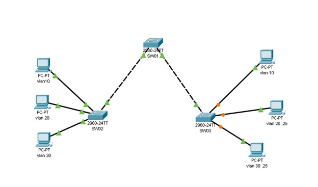

# Коммутация и настройка виртуальных локальных сетей

Проект посвящен основам настройки виртуальных локальных сетей (VLAN) и коммутации. Основная цель — создание топологии сети на базе коммутаторов и настройка VLAN для сегментации сети.

## Цель работы
Изучение основ VLAN и коммутации. Настройка VLAN и топологии сети на основе нескольких коммутаторов.

## Схема сети


## Построение модели сети

1. Запустите Packet Tracer и создайте сеть по схеме, используя следующие параметры для оборудования:

| Устройство | VLAN    | IP-адрес      | Маска подсети   | Шлюз по умолчанию |
|------------|---------|---------------|------------------|--------------------|
| SW01       | VLAN 50 | 192.168.50.11 | 255.255.255.0   | -                 |
| SW02       | VLAN 50 | 192.168.50.12 | 255.255.255.0   | -                 |
| SW03       | VLAN 50 | 192.168.50.13 | 255.255.255.0   | -                 |
| PC1        | VLAN 10 | 192.168.10.23 | 255.255.255.0   | 192.168.10.1      |
| PC2        | VLAN 20 | 192.168.20.24 | 255.255.255.0   | 192.168.20.1      |
| PC3        | VLAN 30 | 192.168.30.25 | 255.255.255.0   | 192.168.30.1      |
| ...        | ...     | ...           | ...             | ...               |

### Настройка портов

| Порты        | Назначение VLAN    | Подсеть           |
|--------------|--------------------|--------------------|
| Fa0/1-Fa0/5  | trunk (802.1Q)     | 192.168.50.0/24   |
| Fa0/6-Fa0/10 | VLAN 10 - Admins   | 192.168.10.0/24   |
| Fa0/11-Fa0/17| VLAN 20 - Sales    | 192.168.20.0/24   |
| Fa0/18-Fa0/24| VLAN 30 - Accounting | 192.168.30.0/24 |

## Основные настройки

1. **Отключение всех портов коммутаторов**:
    ```bash
    Switch>enable
    Switch#config term 
    Switch(config)#interface range fa0/1-24
    Switch(config-if-range)#shutdown 
    ```

2. **Настройка имен коммутаторов**:
    ```bash
    Switch#configure terminal
    Switch(config)#hostname SW01
    ```
    Аналогично настройте имена `SW02` и `SW03`.

3. **Настройка паролей для доступа**:
    ```bash
    SW01(config)#line console 0
    SW01(config-line)#password cisco
    SW01(config-line)#login
    SW01(config)#enable secret class
    ```

4. **Включение интерфейсов и настройка режима access** для портов с ПК:
    ```bash
    SW02(config)#interface range fa0/6, fa0/11, fa0/18
    SW02(config-if-range)#switchport mode access
    SW02(config-if-range)#no shutdown
    ```

### Настройка VLAN

1. **Создание VLAN и присвоение имен на SW01**:
    ```bash
    SW01(config)#vlan 10
    SW01(config-vlan)#name Admins
    SW01(config)#vlan 20
    SW01(config-vlan)#name Sales
    SW01(config)#vlan 30
    SW01(config-vlan)#name Accounting
    SW01(config)#vlan 50
    SW01(config-vlan)#name management
    ```

2. **Назначение портов VLAN** для `SW02` и `SW03`:
    ```bash
    SW02(config)#interface range fa0/6-10
    SW02(config-if-range)#switchport access vlan 10
    SW02(config-if-range)#interface range fa0/11-17
    SW02(config-if-range)#switchport access vlan 20
    ```

3. **Настройка IP-адресов для VLAN 50**:
    ```bash
    SW01(config)#interface vlan 50
    SW01(config-if)#ip address 192.168.50.11 255.255.255.0
    SW01(config-if)#no shutdown
    ```
    Аналогичная настройка для `SW02` и `SW03`.

4. **Настройка trunk-портов**:
    ```bash
    SW01(config)#interface range fa0/1-5
    SW01(config-if-range)#switchport mode trunk
    SW01(config-if-range)#switchport trunk native vlan 50
    ```

## Домашнее задание

1. Добавить новый компьютер к каждому коммутатору, перевести порт в режим `access`.
2. Создать дополнительную VLAN, присвоить ей свое имя.
3. Добавить коммутатор, настроить аналогично другим и добавить новый VLAN.
4. Присвоить IP-адрес новому коммутатору в VLAN 50.
5. Отправить выводы команд `show mac address table`, `show vlan brief`, `show interface trunk`.

## Вопрос для самопроверки
Что такое native VLAN?
