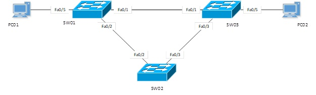
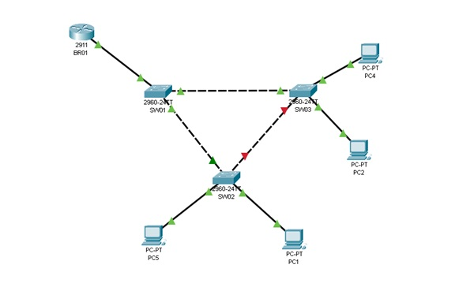

# STP, Inter-VLAN Routing и DHCP

Данный проект посвящен созданию отказоустойчивой сети Ethernet с использованием протокола STP, а также настройке маршрутизации между VLAN и конфигурации DHCP для автоматического назначения IP-адресов.

## Цель работы
- Настроить протокол STP для повышения отказоустойчивости сети.
- Настроить маршрутизацию между VLAN.
- Настроить DHCP для автоматической выдачи IP-адресов.

## 1. Настройка STP

### Построение сети

1. Запустите Packet Tracer и соберите сеть согласно схеме на изображении:
   

2. Выполните следующие действия:
   - Определите корневой коммутатор, войдя в CLI коммутатора и используя команду:
     ```bash
     show spanning-tree
     ```
     **Вопрос:** Почему данный коммутатор стал корневым?

   - Определите состояние портов и убедитесь, что STP работает корректно.
   - Отключите связь между корневым и некорневым коммутаторами, чтобы проверить реакцию сети. **Вопрос:** Что изменилось после отключения?

## 2. Настройка маршрутизации между VLAN (Inter-VLAN Routing)

1. Соберите сеть согласно схеме:
   

2. Настройте оборудование согласно следующей таблице:

   | Устройство | VLAN  | VLAN имя | IP адрес      | Маска подсети   | Шлюз по умолчанию |
   |------------|-------|----------|---------------|-----------------|--------------------|
   | SW01       | VLAN 10 | MGMT    | 10.10.10.2   | 255.255.255.0   | 10.10.10.1        |
   | SW02       | VLAN 10 | MGMT    | 10.10.10.3   | 255.255.255.0   | 10.10.10.1        |
   | SW03       | VLAN 10 | MGMT    | 10.10.10.4   | 255.255.255.0   | 10.10.10.1        |
   | BR01       | 0/0.10 | -        | 10.10.10.1   | 255.255.255.0   |                    |
   | BR01       | 0/0.25 | -        | 10.10.20.5   |                 |                    |
   | BR01       | 0/0.35 | -        | 10.10.20.129 |                 |                    |
   | BR01       | 0/0.45 | -        | 10.10.30.142 |                 |                    |
   | PC1        | VLAN 25 | HR      | 10.10.20.0/25|                 |                    |
   | PC2-3      | VLAN 35 | ADMIN   | 10.10.20.128/25 |               |                    |
   | PC4-5      | VLAN 45 | Sales   | 10.10.30.0/24 |                |                    |

3. Добавьте на коммутаторы необходимые VLAN, присвойте имена и назначьте порты VLAN (access или trunk) в соответствии с требованиями.

### Настройка маршрутизатора

1. Присвойте маршрутизатору имя `BR01`:
   ```bash
   Router#configure terminal
   Router(config)#hostname BR01
   ```
2. Настройте сабинтерфейсы на маршрутизаторе для VLAN:
   ```bash
   BR01(config)#interface gi0/0.10
   BR01(config-subif)#encapsulation dot1Q 10
   BR01(config-subif)#ip address 10.10.10.5 255.255.255.128
   ```
3. Настройка DHCP
   ```bash
   BR01(config)#ip dhcp pool HR
   BR01(dhcp-config)#network 10.10.20.0 255.255.255.128
   BR01(dhcp-config)#default-router 10.10.20.5
   ```
   Включите DHCP на ПК и проверьте, что каждый ПК получает IP-адрес автоматически.
4. Тестирование сети
   
   Проверьте связь между ПК в разных VLAN, используя команду ping на каждом ПК для проверки доступности устройств в других подсетях.
