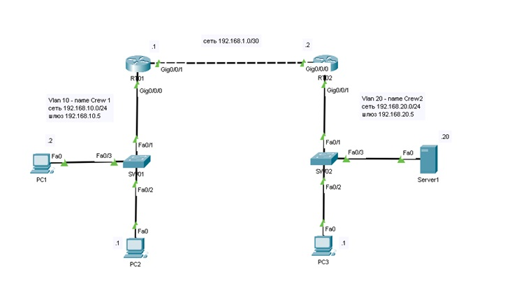
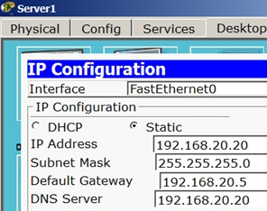

# Настройка трёх сетей с WEB-сервером и статическими маршрутами

Этот проект демонстрирует настройку трёх VLAN-сетей, подключённых через маршрутизатор, а также работу с веб-сервером и добавление статических маршрутов для обеспечения связи между подсетями.

## Цель работы
- Настроить VLAN на коммутаторах для трёх сетей.
- Настроить маршрутизатор и сервер.
- Понять принципы работы статической маршрутизации.

## Структура сети
Соберите сеть согласно схеме, изображённой на рисунке ниже:


## Шаги настройки

### 1. Настройка коммутаторов и VLAN
- Создайте необходимые VLAN на коммутаторах.
- Настройте порты для подключения устройств:
    - **Порты, подключенные к ПК** – режим `access`, назначить соответствующие VLAN.
    - **Порты для маршрутизатора** – режим `trunk`, для передачи трафика между VLAN.

### 2. Настройка интерфейсов маршрутизатора
- Настройте интерфейсы маршрутизатора для взаимодействия с каждой VLAN согласно сети.

### 3. Настройка адресации сервера
- Установите на сервере IP-адрес и шлюз по умолчанию, как указано на схеме:
    - **DNS-сервер**: 192.168.20.20
- Настройте сетевые параметры в соответствии с сетью.



### 4. Настройка адресации ПК
- Установите статическую IP-адресацию на ПК, согласно схеме.

### 5. Проверка связи
- Выполните пинг с ПК2 на ПК3. Ожидается отсутствие связи из-за отсутствия маршрутизации между VLAN.

### 6. Добавление статических маршрутов
- Добавьте статические маршруты на маршрутизаторе для подсетей:
    ```bash
    ip route 192.168.20.0 255.255.255.0 192.168.1.2
    ```
### 7. Повторная проверка связи
- Выполните повторный пинг с ПК2 на ПК3. Теперь связь должна быть установлена.
### 8. Проверка маршрутизации
- Выполните команду `tracert` из командной строки на ПК1 или ПК2 для проверки маршрута до веб-сервера по адресу 192.168.20.20. Запишите вывод.