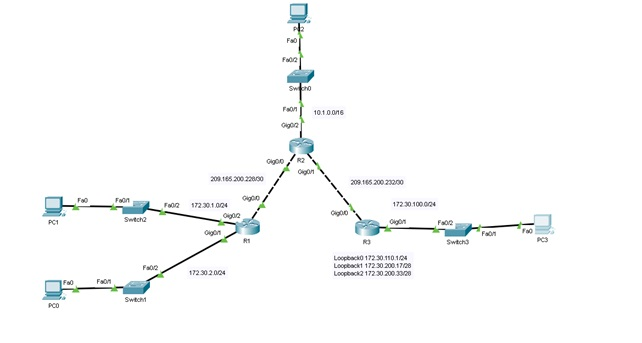
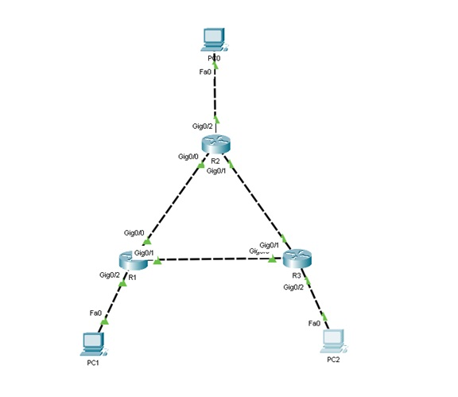

# Настройка маршрутизации с использованием протоколов RIP и OSPF

В этом проекте реализуется настройка протоколов маршрутизации RIP и OSPF для связи между подсетями в сети. Схема сети включает несколько маршрутизаторов и сетей с использованием протокола RIP для обмена маршрутной информацией и протокола OSPF для оптимизации маршрутизации.

## Часть 1: Протокол RIP

### Цель
Настроить и проверить работу протокола RIP на маршрутизаторах для обеспечения связи между сетями.

### Шаги настройки

1. **Соберите сеть по схеме** с использованием маршрутизатора Cisco 2911.
   
2. **Настройте интерфейсы** маршрутизаторов R1, R2 и R3 согласно схеме.

3. **Настройте протокол RIP** на маршрутизаторах:
   - На R1 добавьте сети `172.30.0.0` и `209.165.200.0`.
   - На R2 добавьте сети `10.0.0.0`, `172.30.0.0`, и `209.165.200.0`.
   - Установите интерфейсы `GigabitEthernet0/1` и `GigabitEthernet0/2` как пассивные на всех маршрутизаторах:
     ```bash
     router rip
     passive-interface GigabitEthernet0/2
     network 10.0.0.0
     network 209.165.200.0
     ```

4. **Проверьте таблицу маршрутизации** на всех маршрутизаторах командой:
   ```bash
   show ip route
   ```

5. **Настройте протокол RIP версии 2**:
   ```bash
   router rip
   version 2
   ```

6. **Отключите автоматическую суммаризацию**:
   ```bash
   router rip
   no auto-summary
   ```

## Часть 2: Протокол OSPF

### Цель
Настроить OSPF для обмена маршрутами между несколькими подсетями и оптимизировать связь между маршрутизаторами.

### Шаги настройки

1. **Соберите сеть** согласно схеме с использованием маршрутизатора Cisco 2911.
   
2. **Настройте интерфейсы маршрутизаторов и ПК** в соответствии с таблицей ниже:

   | Устройство | Интерфейс | IP-адрес       | Маска подсети     | Шлюз         |
      |------------|-----------|----------------|--------------------|--------------|
   | R1         | Gi0/2     | 172.16.1.17    | 255.255.255.240   | -            |
   |            | Gi0/0     | 192.168.10.1   | 255.255.255.252   | -            |
   |            | Gi0/1     | 192.168.10.5   | 255.255.255.252   | -            |
   | R2         | Gi0/2     | 10.10.10.1     | 255.255.255.0     | -            |
   |            | Gi0/0     | 192.168.10.2   | 255.255.255.252   | -            |
   |            | Gi0/1     | 192.168.10.9   | 255.255.255.252   | -            |
   | R3         | Gi0/2     | 172.16.1.33    | 255.255.255.248   | -            |
   |            | Gi0/0     | 192.168.10.6   | 255.255.255.252   | -            |
   |            | Gi0/1     | 192.168.10.10  | 255.255.255.252   | -            |
   | PC1        | -         | 172.16.1.20    | 255.255.255.240   | 172.16.1.17  |
   | PC0        | -         | 10.10.10.10    | 255.255.255.0     | 10.10.10.1   |
   | PC2        | -         | 172.16.1.35    | 255.255.255.248   | 172.16.1.33  |

3. **Настройка OSPF на R1**:
   ```bash
   router ospf 1
   network 172.16.1.16 0.0.0.15 area 0
   network 192.168.10.0 0.0.0.3 area 0
   network 192.168.10.4 0.0.0.3 area 0
   ```

4. **Настройка OSPF на R2 и R3** аналогично R1.

5. **Проверка соседства маршрутизаторов**:
   ```bash
   show ip ospf neighbor
   ```

6. **Проверка всех подсетей в таблице маршрутизации**:
   ```bash
   show ip route
   ```

7. **Проверка настроек OSPF**:
   ```bash
   show ip protocols
   show ip ospf
   ```

8. **Проверка интерфейсов OSPF**:
   ```bash
   show ip ospf interface brief
   ```

9. **Настройка интерфейсов loopback** на маршрутизаторах:
    - R1: `1.1.1.1/32`
    - R2: `2.2.2.2/32`
    - R3: `3.3.3.3/32`

10. **Сохраните конфигурацию и перезагрузите маршрутизаторы**:
    ```bash
    write memory
    reload
    ```

11. **Изменение Router ID** на маршрутизаторах:
    ```bash
    router ospf 1
    router-id 11.11.11.11
    ```

12. **Проверка Router ID и соседства**:
    ```bash
    show ip protocols
    show ip ospf neighbor
    ```

13. **Проверка таймера hello-пакетов** на интерфейсе Gi0/2:
    ```bash
    show ip ospf interface gi0/2
    ```

14. **Изменение интерфейсов на пассивные**:
    ```bash
    router ospf 1
    passive-interface g0/2
    ```

15. **Проверка анонсирования подсети 172.16.1.16/28** на R2 и R3:
    ```bash
    show ip route
    ```

16. **Перевод всех интерфейсов в пассивный режим на R2**:
    ```bash
    router ospf 1
    passive-interface default
    ```

17. **Проверка соседства** на R1 после изменения интерфейсов:
    ```bash
    show ip ospf neighbor
    ```

18. **Отмена пассивного режима** на интерфейсе Gi0/0 на R2:
    ```bash
    router ospf 1
    no passive-interface gi0/0
    ```

19. **Проверка маршрутизации**:
    ```bash
    show ip route
    ```
