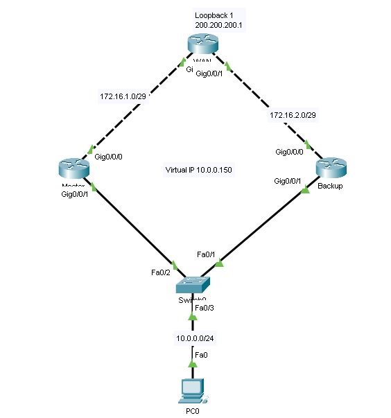

# Настройка сети с использованием HSRP и RIP

В этом проекте настраивается отказоустойчивая сеть с использованием протоколов HSRP и RIP. Основные устройства включают маршрутизаторы WAN, Master и Backup для создания отказоустойчивого шлюза.

## Шаги настройки

### 1. Сборка схемы сети

Соберите сеть по изображению ниже:



### 2. Настройка маршрутизатора WAN

1. **Настройте интерфейсы и интерфейс loopback** на маршрутизаторе WAN в соответствии с конфигурацией сети.
2. **Настройте протокол RIP** для обмена маршрутами.

### 3. Настройка маршрутизатора Master

1. **Настройте интерфейсы** на маршрутизаторе Master в соответствии с топологией сети.
2. **Настройте HSRP** для обеспечения отказоустойчивого шлюза:
   - Установите виртуальный IP-адрес для группы HSRP:
     ```bash
     standby 1 ip 10.0.0.150
     ```
   - Настройте приоритет (101), чтобы Master стал активным маршрутизатором:
     ```bash
     standby 1 priority 101
     ```
   - Включите preempt, чтобы Master автоматически стал активным при восстановлении:
     ```bash
     standby 1 preempt
     ```
   - Добавьте отслеживание состояния интерфейса (например, `GigabitEthernet0/0/1`) для повышения отказоустойчивости:
     ```bash
     standby 1 track GigabitEthernet0/0/1
     ```

3. **Проверьте состояние HSRP** на маршрутизаторе Master, используя команды:
   ```bash
   show standby
   show standby brief
   ```

4. **Настройте протокол RIP** для маршрутизации сети на маршрутизаторе Master.

### 4. Настройка маршрутизатора Backup

1. **Настройте интерфейсы** на маршрутизаторе Backup аналогично настройкам на Master.
2. **Настройте RIP** для маршрутизации сети.
3. **Настройте HSRP** с параметрами для Backup:
    - Установите тот же виртуальный IP-адрес:
      ```bash
      standby 1 ip 10.0.0.150
      ```
    - Установите приоритет ниже, чем у Master (99):
      ```bash
      standby 1 priority 99
      ```
    - Включите preempt для автоматического переключения при отказе Master:
      ```bash
      standby 1 preempt
      ```
    - Добавьте отслеживание состояния интерфейса:
      ```bash
      standby 1 track GigabitEthernet0/0/1
      ```

### 5. Проверка работы HSRP и отказоустойчивости

1. **Проверьте доступность шлюза** с ПК, чтобы убедиться, что трафик проходит через активный маршрутизатор Master.
2. **Сымитируйте отказ** маршрутизатора Master и убедитесь, что маршрутизатор Backup берет на себя роль активного маршрутизатора.
3. **Восстановите маршрутизатор Master** и убедитесь, что он снова становится активным маршрутизатором.

## Дополнительная схема с LACP (Link Aggregation Control Protocol)

Для повышения пропускной способности и отказоустойчивости, настройте агрегацию каналов между коммутаторами с помощью LACP.
